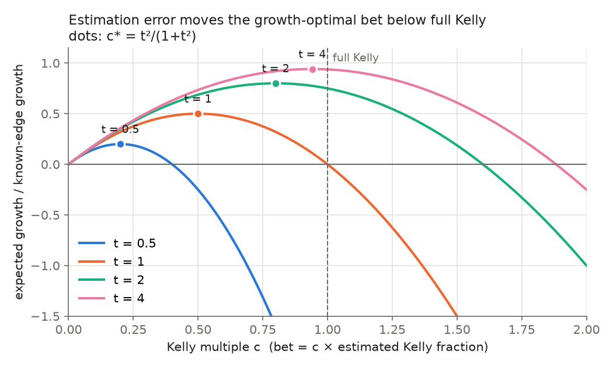
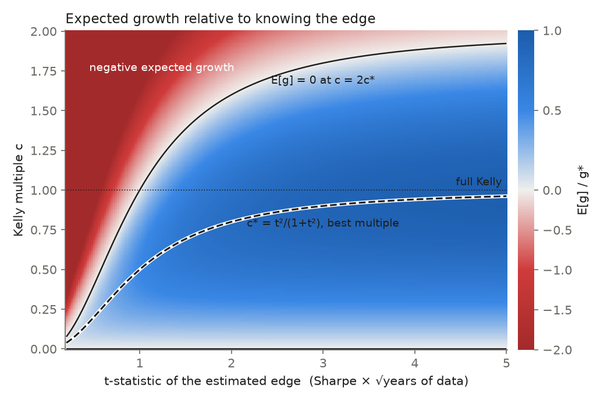

# Kelly sizing under parameter uncertainty

Kelly gives the growth-optimal bet **given the true edge**. In practice you only
have an estimate of the edge. This study measures exactly what that gap costs,
derives the best response to it, and checks every formula against an
independent Monte Carlo simulation.

It is self-contained (NumPy only; matplotlib for figures) and has no dependency
on the order-book code in this repository.

```
python3 kelly/test_kelly_lib.py          # 42 checks, ~2 s
python3 kelly/run_study.py --figures     # comparison tables + figures/*.png
```

## The result

An asset follows dS/S = μ dt + σ dW. Holding a constant fraction f of wealth
grows log wealth at

    g(f) = μf − σ²f²/2,     maximised by the Kelly fraction f* = μ/σ², where g* = μ²/(2σ²).

Replace μ with an estimate μ̂ ~ N(μ, s²) and bet c times the Kelly fraction of
the *estimate*, f = c·μ̂/σ². Averaging g over the estimation noise gives:

    E[g] = ( c·μ² − (c²/2)·(μ² + s²) ) / σ²

Consequences, with t = μ/s the t-statistic of the edge:

| | |
|---|---|
| **Full Kelly** (c = 1) | E[g] = (μ² − s²)/(2σ²). **Zero at t = 1, negative below.** |
| **Best multiple** | c* = t²/(1 + t²), a shrinkage factor |
| **Break-even multiple** | E[g] = 0 at c = 2c* |
| **Data needed** | with T years of data, s = σ/√T, so t = Sharpe × √T |
| **Headline** | Sharpe 1 with one year of data gives t = 1: **half Kelly is optimal and full Kelly has zero expected growth** |
| **Drawdowns** (μ known) | P(ever falling to fraction x of starting wealth) = x^(2/c − 1): ½ for full Kelly, ⅛ for half |





### What the simulation adds beyond the formula

From `run_study.py`: Sharpe 1, σ = 20% (so f* = 5x leverage), 10-year trading
horizon, 20,000 paths. All rules share the same random draws.

At **t = 1** (one year of data):

| rule | E[g] /yr | median | P(ever halved) | median max DD |
|---|---:|---:|---:|---:|
| full Kelly | +0.008 | +0.195 | 0.59 | 95% |
| ½ Kelly (= oracle c*) | +0.254 | +0.269 | 0.32 | 70% |
| plug-in c*(t̂) | +0.116 | +0.135 | 0.37 | 72% |
| Bayes, prior Sharpe sd 0.5 | +0.162 | +0.154 | 0.11 | 35% |
| fixed f = 1 | +0.180 | +0.180 | 0.002 | 28% |

Points worth making in the write-up:

1. **Estimating the shrinkage doesn't recover it.** The plug-in rule uses
   t̂ = μ̂/s in place of t, and t̂ is large exactly when μ̂ has come out too
   high. So it shrinks least when it should shrink most. At t ≤ 1 it loses
   badly to a plain fixed ½ Kelly (−0.13 vs +0.13 at t = 0.7). At t = 2 it
   edges past ½ Kelly but is still well short of the oracle (0.357 vs 0.404).
2. **Uncertainty alone doesn't shrink a log-optimal bet.** g is linear in μ,
   so the Bayes-optimal fraction is simply E[μ | data]/σ². Posterior variance
   never enters. The shrinkage comes from the *prior*. With prior N(0, μ²)
   the Bayes rule reproduces c* exactly (this is tested). c* is the
   empirical-Bayes answer.
3. **The mean hides the damage.** With a mean growth near zero, full Kelly at
   t = 1 still has a positive median, but a 59% chance of halving and a
   median drawdown of 95%. Report the distribution, not just E[g].
4. **Fixed fraction wins here only because it's small and ignores the noise.**
   f = 1 is ⅕ Kelly for this edge. It is not a general answer, and the
   edge-decay table shows the flip side: when the edge disappears after it was
   measured, every rule sized from the estimate turns into leveraged noise.

## Layout

| file | contents |
|---|---|
| `kelly_lib.py` | closed forms, sizing rules, continuous and binary Monte Carlo engines |
| `test_kelly_lib.py` | each formula against brute-force search *and* against simulation |
| `run_study.py` | scenario tables and figures |

Modelling choices, stated so they can be challenged:

- σ is known and only μ is estimated. With σ known, the MLE of μ from T years
  is exactly N(μ, σ²/T), so μ̂ is drawn directly rather than from a
  simulated history.
- Rebalancing is continuous. Log wealth advances by its exact GBM increment, so
  terminal growth is exact at any step size. The step only controls how
  finely drawdowns are monitored. Discrete monitoring under-counts barrier
  hits; the tests apply the Broadie–Glasserman–Kou correction.
- No costs, no borrowing spread, no leverage limit unless `f_cap` is set.
- Binary bets: a negative estimated edge means no bet, and stakes are capped at
  100%. Losing a 100% stake is ruin (growth −∞), and it is reported as such.

## Roadmap (week 2)

- [ ] **Estimated σ as well as μ**: the Kelly fraction then involves the
      estimated σ² in the denominator, which adds a second, skewed error source.
- [ ] **Fat tails**: Student-t returns with the same mean and variance in a
      discrete-time version. The Gaussian formula overbets. By how much, as a
      function of the degrees of freedom?
- [ ] **Binary study**: sweep `n_est` in `simulate_binary`. Near f → 1 the
      over/under asymmetry is global (log(1 − f) → −∞), but locally it
      depends on the odds: at even money over-betting costs more, while for
      long shots (b = 10, p = 0.1) the third derivative of g changes sign.
- [ ] **Multi-asset**: f = Σ⁻¹μ with an estimated Σ. Estimation error in the
      inverse covariance explodes with dimension (Michaud's "error maximisation").
- [ ] **Apply it to a real signal**: take the per-trade edge distribution from
      `research/ofi_study.ipynb`, estimate its t-stat honestly (overlapping
      trades, autocorrelation), and size it.

## References

- Kelly (1956), *A New Interpretation of Information Rate*
- Thorp (2006), *The Kelly Criterion in Blackjack, Sports Betting and the Stock Market*
- MacLean, Thorp & Ziemba (2011), *The Kelly Capital Growth Investment Criterion*
- Browne & Whitt (1996), *Portfolio choice and the Bayesian Kelly criterion*
- Broadie, Glasserman & Kou (1997), *A continuity correction for discrete barrier options*
- Michaud (1989), *The Markowitz Optimization Enigma: Is 'Optimized' Optimal?*
